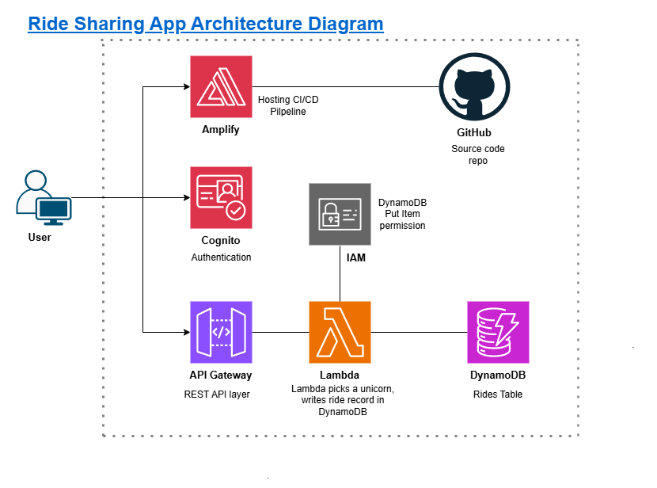

#  Swift Rydes : Serverless Unicorn Ride-Sharing App

Swift Rydes is a full end-to-end serverless web application built on AWS that 
demonstrates a production-style cloud architecture using 7 core AWS services. 
Users can register, authenticate, and request a unicorn ride by clicking on an 
interactive ArcGIS map - the nearest unicorn is then dispatched to their location.

---

##  Architecture Diagram

---

##  AWS Services Used

| Service | Purpose |
|---|---|
| **AWS Amplify** | Hosts the static frontend and provides CI/CD pipeline from GitHub |
| **GitHub** | Source control - pushes trigger automatic Amplify deploys |
| **Amazon Cognito** | User registration, login, and JWT token issuance |
| **Amazon API Gateway** | REST API with Cognito JWT authorizer |
| **AWS Lambda** | Serverless `requestUnicorn` function (Node.js 22.x) |
| **Amazon DynamoDB** | `Rides` table - stores ride records |
| **AWS IAM** | Lambda execution role with `dynamodb:PutItem` inline policy |

---

##  How It Works

1. **Code push → Auto deploy** - GitHub push triggers Amplify to build and deploy the frontend
2. **Sign up / Log in** - Cognito handles auth and returns a JWT token to the browser
3. **Request a ride** - User clicks the map; browser sends `POST /ride` to API Gateway with the JWT in the `Authorization` header
4. **Token validation** - API Gateway validates the JWT via the Cognito authorizer
5. **Lambda executes** - `requestUnicorn` picks a random unicorn and writes the ride to DynamoDB using `PutItem`
6. **Response** - Lambda returns unicorn details → API Gateway → browser shows arrival info

---
